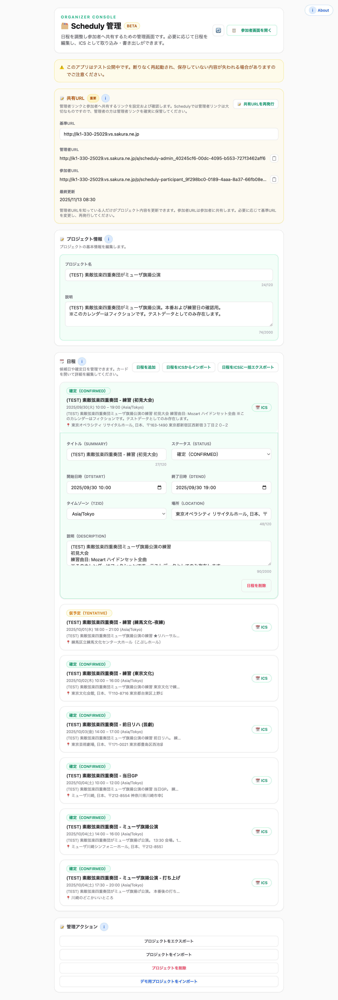
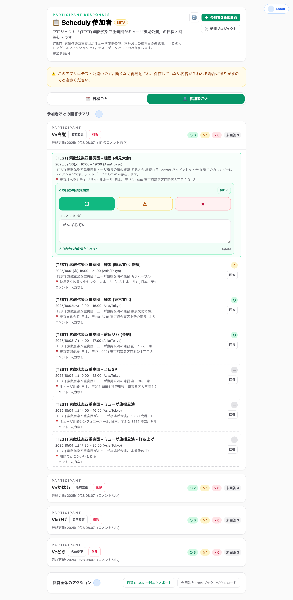

# Screen Overview

Scheduly の UI は次の 2 画面で構成されます。ここでは「何ができるか」を中心に、役割と主要要素、画面間の関係を簡潔に整理します。アクセス方式や保存ポリシーなどの前提は `docs/external/concept-assumptions.md` を参照。技術的な詳細は `docs/internal/ref-screen-tech-overview.md` を参照してください。

## 管理画面（Admin Console）

- **目的**: プロジェクト情報の編集、候補日（イベント）管理、ICS のインポート／エクスポート、共有 URL の生成など主催者向け操作をまとめる。
- **主要 UI**:
- プロジェクト情報フォーム（タイトル・説明）
- 候補日カード（確定／仮／取消しラベル、日時、場所、メモ）
- ICS 個別／一括エクスポート、ICS インポートプレビュー
- プロジェクト JSON のエクスポート／インポート
- 共有 URL（管理者／参加者）生成と表示
- API 連携（開発環境）: `window.__SCHEDULY_PROJECT_DRIVER__ = "api"; window.__SCHEDULY_API_BASE_URL__ = "http://localhost:4000";` をコンソールで設定すると、サーバーとの同期挙動を確認できる。
  

  

## 参加者 UI（Participant Dashboard）

- **目的**: 参加者・主催者の双方が全候補の概要と回答サマリーを確認し、出欠状況を把握・更新できるようにする。
- **主要 UI**:
  - 「日程ごと」「参加者ごと」のタブ切り替え
  - 各候補日カード：日付・時間・場所・説明・回答サマリー（○△×）
  - 個別参加者の回答一覧（参加者タブ）とカード内インライン編集（○△× とコメント）
  

  

## 画面間の関係

1. **管理画面**で候補やプロジェクト情報を編集し、参加者向け URL を発行する。
2. 参加者は共有された **参加者 UI** で概要を確認し、カード内のインライン編集で自身の回答（○△×／コメント）を更新する。
3. 回答更新は即時集計され、タブ/カードに反映される。

保存方針やバリデーションの前提は `docs/external/concept-assumptions.md` を参照。技術的なデータフローや再計算の仕組みは `docs/internal/ref-screen-tech-overview.md` に記載しています。

## 主要機能チェックリスト
- [x] 候補日（日時・場所・説明・ステータス）の作成・編集
- [x] ICS の個別/一括インポートおよびエクスポート
- [x] プロジェクト JSON のバックアップ／復元
- [x] 管理者URL・参加者URL の生成と表示（秘密URLモデル）
- [x] 参加者からの回答（○/△/×・コメント）のインライン編集
- [x] 回答サマリー（タブ切替で日程別/参加者別）のリアルタイム集計
- [x] Excel 形式での回答一覧エクスポート
- [x] InfoBadge による画面内ガイド

### スクリーンショット更新ルール
- UI を変更した際は `docs/screenshot/*.png` を撮り直し、本ドキュメントの画像パスを必要に応じて更新する。
- 画像ファイル名は用途が分かるように `scheduly-<画面>-screenshot.png` の形式で統一する。
